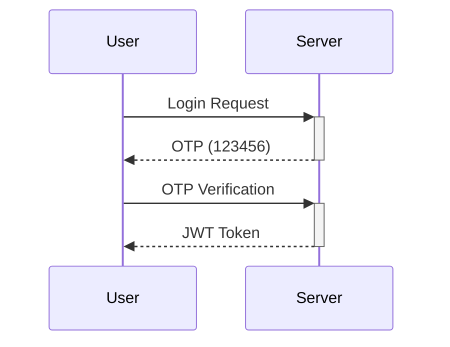

# 🎓 EduTrack

**A Modern Educational Management Platform**  
*Built with Django, Docker, and Service-Oriented Architecture*  
[](https://github.com/Sayrikey1/EduTrack/actions) [](https://hub.docker.com/r/sayrikey1/edutrack)

  
*Replace with actual architecture diagram*

## 🌟 Key Features

- 👨🏫 **Role-Based Access Control** (Students, Teachers, Admins)
- 📚 **Course Management** with enrollment tracking
- 📝 **Assignment System** with submission grading
- 🔐 **Secure Authentication** with OTP verification
- 📊 **CRM Integration** for educational institutions
- 🐳 **Dockerized Deployment** for dev/prod environments
- ✅ **Comprehensive Test Suite** with 90%+ coverage

## 🏗️ Project Structure

```text
EduTrack/
├── accounts/          # User management & authentication 🔐
├── api/               # REST API endpoints 🌐
├── assignments/       # Assignment lifecycle 📝
├── core/              # Project configuration ⚙️
├── courses/           # Course management 📚
├── crm/               # Client relations 🤝
├── docker/            # Container configs 🐳
├── services/          # Shared utilities 🔧
├── tests/             # Automated tests ✅
└── .github/           # CI/CD workflows 🛠️
```

## 🚀 Quick Start

### Prerequisites
- Python 3.12+
- Docker & Docker Compose
- PostgreSQL 12+

### Local Development
1. **Clone Repository**
   ```bash
   git clone https://github.com/Sayrikey1/EduTrack.git
   cd EduTrack
   ```

2. **Setup Environment**
   ```bash
   cp docker/dev.env .env
   # Update .env with your credentials
   ```

3. **Run with Docker**
   ```bash
   chmod +x docker/entrypoint.sh  # Make entrypoint executable
   docker-compose --env-file docker/dev.env up --build
   ```

4. **Access Application**
   - API: `http://localhost:8000`

## 🔧 Key Configuration

| Environment Variable | Description                  | Example Value              |
|----------------------|------------------------------|----------------------------|
| `SECRET_KEY`         | Django secret key            | `your-super-secret-key`    |
| `DB_ENGINE`          | Database engine              | `django.db.backends.postgresql` |
| `DB_NAME`            | Database name                | `edutrack_dev`             |
| `APP_ENC_KEY`        | Encryption key               | `32-char-random-string`    |
| `DEBUG`              | Debug mode                   | `True` (dev)/`False` (prod)|

## 🧪 Testing & QA

**Run Test Suite**
```bash
# With test database persistence
python manage.py test --keepdb --settings=core.settings.dev

# Production configuration tests
python manage.py test --settings=core.settings.prod
```

**Test Coverage Report**
```bash
coverage run manage.py test --settings=core.settings.dev
coverage report -m
```

## 🛡️ Security Features

### Authentication Flow


### Key Protections
- 🔑 PBKDF2 password hashing
- 🚫 CSRF protection middleware
- 🔒 Content Security Policy (CSP)
- 📨 Secure cookie settings
- 🕒 Session timeout (30min inactivity)

## ☁️ Production Deployment

1. **Prepare Environment**
   ```bash
   cp docker/prod.env .env
   # Configure production values in .env
   ```

2. **Docker Deployment**
   ```bash
   docker-compose --env-file docker/prod.env up --build -d
   ```

3. **Verify Services**
   ```bash
   docker ps -a  # Check container status
   docker logs edutrack-web  # View logs
   ```

## 🤝 Contributing

We welcome contributions! Please follow these steps:

1. Fork the repository
2. Create feature branch:  
   `git checkout -b feature/amazing-feature`
3. Commit changes:  
   `git commit -m 'Add amazing feature'`
4. Push to branch:  
   `git push origin feature/amazing-feature`
5. Open a Pull Request

See [CONTRIBUTING.md](CONTRIBUTING.md) for detailed guidelines.

## 📄 License

EduTrack is [MIT licensed](LICENSE).

---

**Made with ❤️ by [Sayrikey1](https://github.com/Sayrikey1)**  
[](https://github.com/Sayrikey1/EduTrack/stargazers) [](https://twitter.com/yourhandle)
